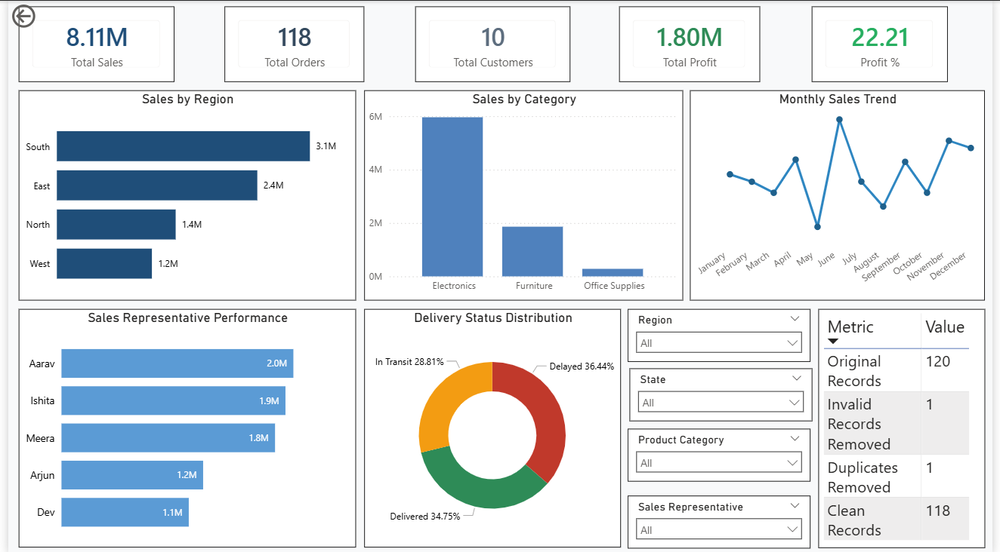

# Sales Data Cleaning & Reporting System

## Dashboard Preview

## Project Objective

Develop an end-to-end sales data cleaning and reporting solution to improve data quality and generate accurate business insights.

## Tools Used

* PostgreSQL
* Power BI
* Excel
* GitHub

## Project Workflow

Raw Data → Data Profiling → Data Cleaning → Data Validation → Reporting Queries → Power BI Dashboard → Business Insights

## Dataset Features

* Sales Transactions
* Customer Information
* Product Categories
* Regional Sales Data
* Delivery Performance Data

## Data Quality Issues Addressed

* Missing Values
* Duplicate Records
* Invalid Sales Values
* Category Inconsistencies
* Region Naming Errors

## Key KPIs

* Total Sales: ₹8.11M
* Total Profit: ₹1.80M
* Profit Margin: 22.21%
* Total Orders: 118

## Dashboard Features

* KPI Cards
* Sales by Region
* Sales by Category
* Monthly Sales Trend
* Sales Representative Performance
* Delivery Status Analysis
* Data Quality Summary

## Key Insights

* South Region achieved the highest sales performance.
* Data cleaning improved reporting accuracy.
* Standardized datasets support better business decisions.

## Repository Structure

data/
sql/
powerbi/
dashboard_screenshots/
reports/
README.md

## Author

Rohan Patel
Aspiring Data Analyst
